# LogiTrack — Logistics Inquiry & Vendor Quote System

A full-featured logistics management system built with React + TypeScript, demonstrating scalable UI design, Redux state management, and role-based access control.

🔗 **Live Demo:** https://vendor-management-rw21.vercel.app/

---

## Tech Stack

| Layer        | Technology                                           |
| ------------ | ---------------------------------------------------- |
| Build        | Vite 8 + ESNext target                               |
| Language     | TypeScript (strict mode)                             |
| UI           | React 19 + Tailwind CSS v4                           |
| State        | Redux Toolkit + typed hooks                          |
| Routing      | React Router v7 (lazy-loaded routes)                 |
| Validation   | Yup                                                  |
| Select UI    | react-select                                         |
| Toasts       | Sonner                                               |
| Print        | react-to-print                                       |
| Tests        | Vitest + Testing Library                             |
| Data         | Mock/Static JSON (no backend)                        |
| Code Quality | ESLint + Prettier + Husky + lint-staged + commitlint |

> **Why Redux Toolkit?** Used Redux Toolkit for state management to keep async API calls and auth state predictable across the app. For a production system this scales better than prop-drilling or context.

---

## Features (12 Screens)

| #   | Screen                   | Description                                                      |
| --- | ------------------------ | ---------------------------------------------------------------- |
| 1   | **Login**                | Auth with session persistence (localStorage)                     |
| 2   | **Dashboard**            | Summary cards: Total Inquiries, Pending/Approved Quotes, Vendors |
| 3   | **Inquiry Form**         | Create inquiry with auto-generated Inquiry No                    |
| 4   | **Inquiry List**         | Table with search, pagination, status filter                     |
| 5   | **Get Vendor Quotes**    | Link inquiry to multiple vendor quote requests                   |
| 6   | **Actual Vendor Quotes** | Inline-edit quoted amounts, transit days, status                 |
| 7   | **User Management**      | Create users with branch & active/inactive toggle                |
| 8   | **Role Management**      | Create roles (Admin, Manager, Operator, Viewer)                  |
| 9   | **User-Role Mapping**    | Assign roles to users                                            |
| 10  | **Branch-wise Access**   | Per-branch permissions matrix (View/Add/Edit/Delete)             |
| 11  | **Reports**              | Filterable Inquiry + Vendor Quote reports                        |
| 12  | **Print Layout**         | Printable format with Print button                               |

---

## Screenshots

### Login
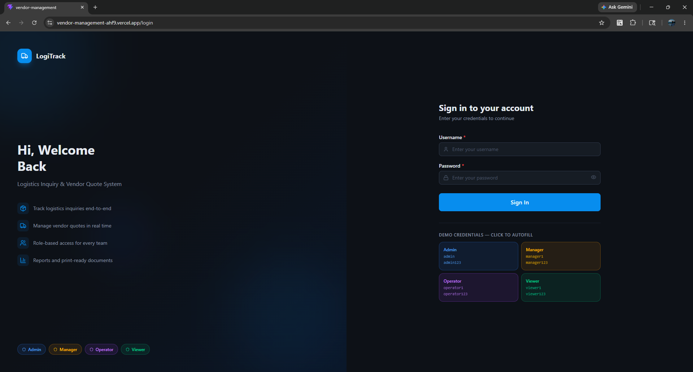
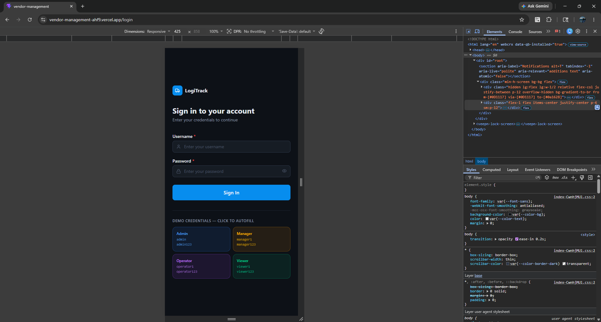

### Dashboard
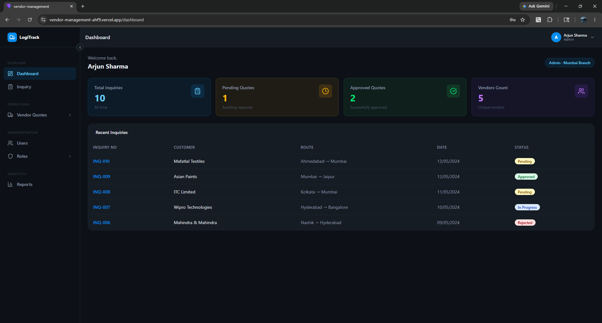
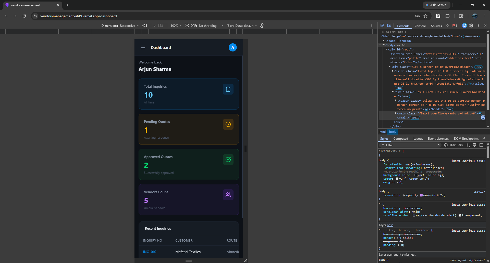

### Inquiry List
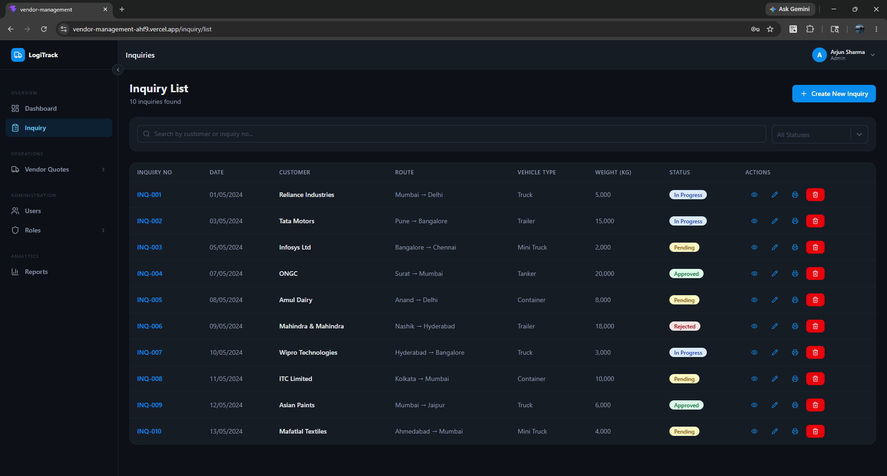
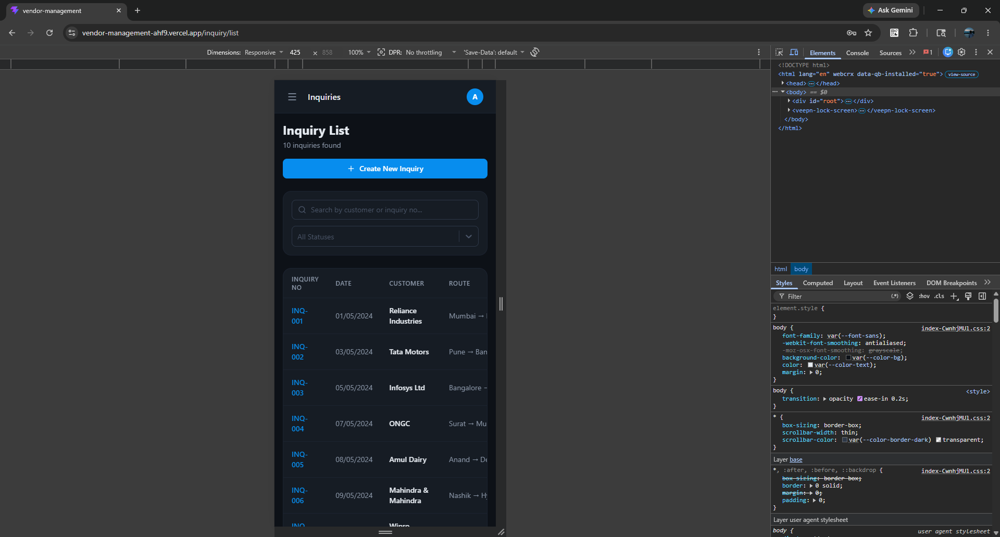

### Inquiry Form
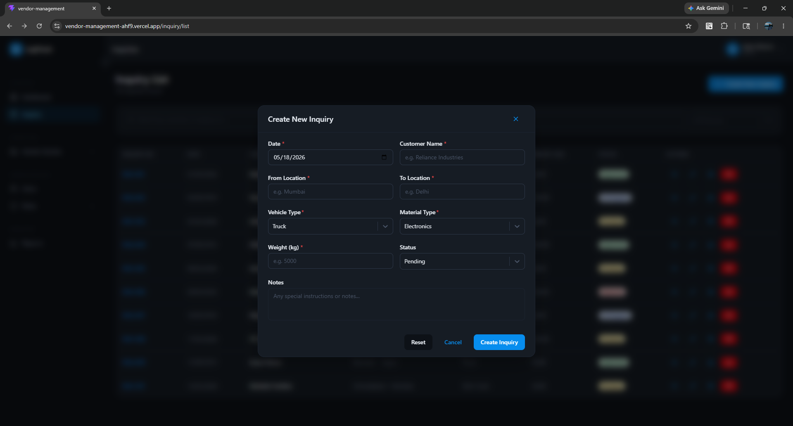

### Vendor Quote Get
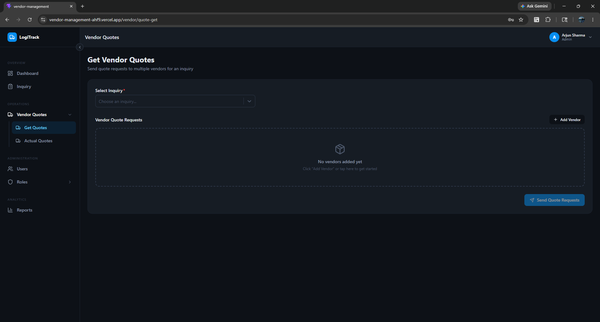

### Actual Vendor Quotes
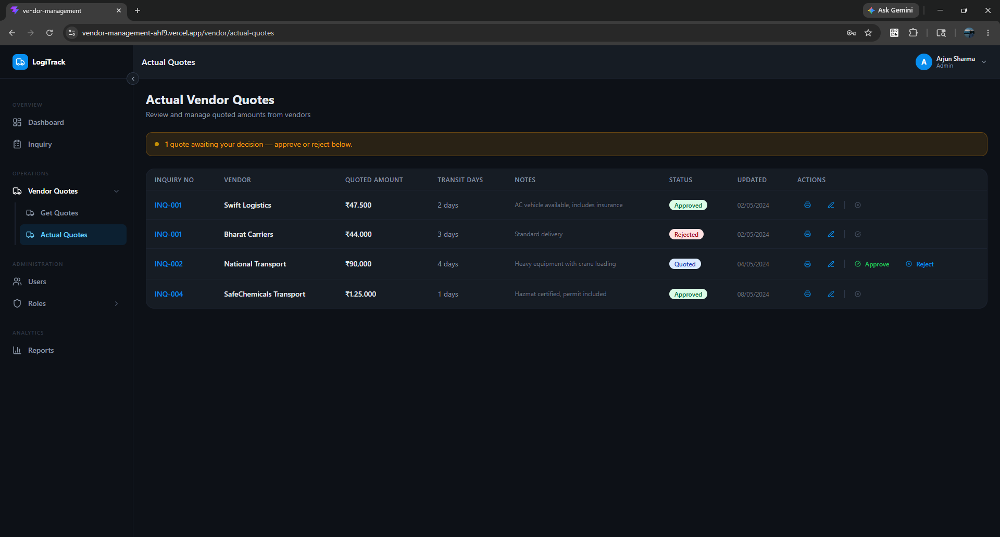

### User Management
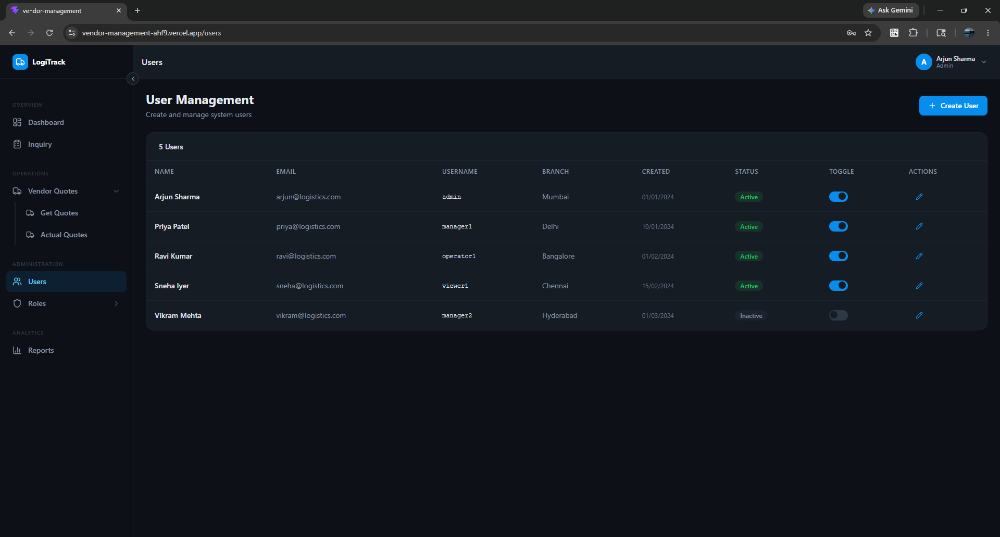
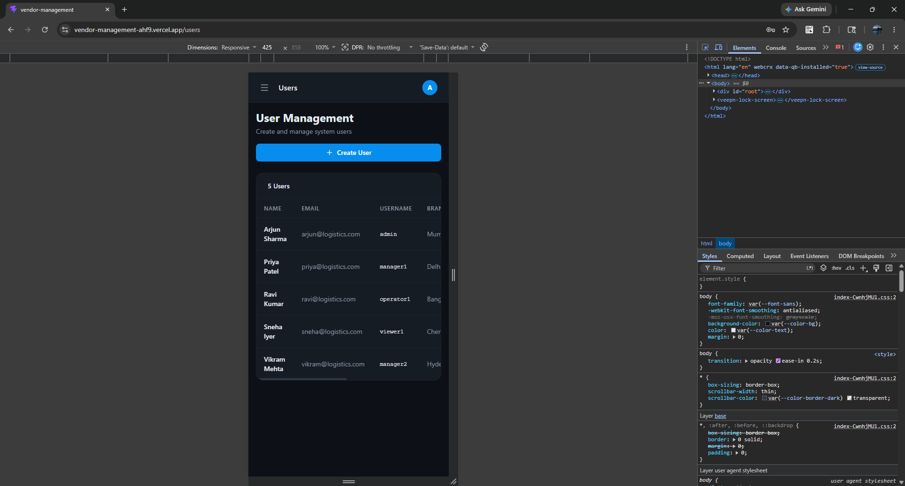

### Role Management
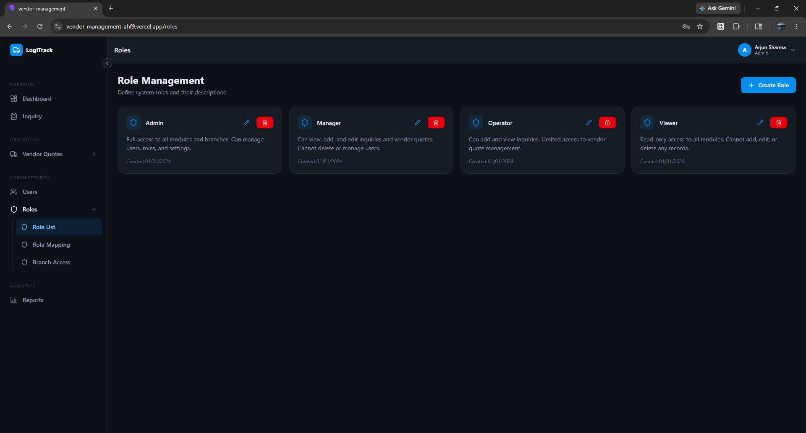

### User-Role Mapping
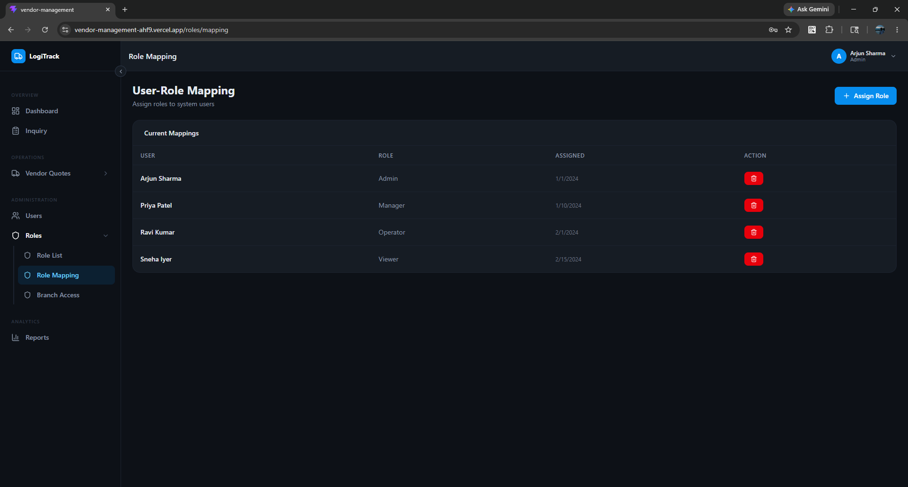

### Branch-wise Role Access
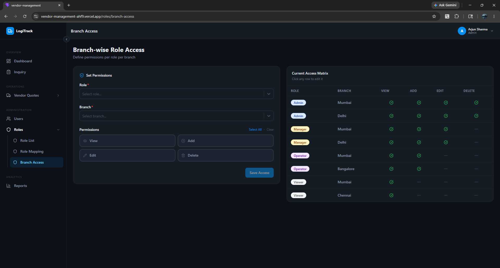

### Reports
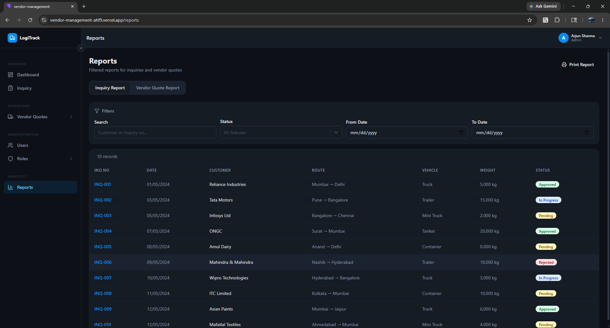

### Print Layout
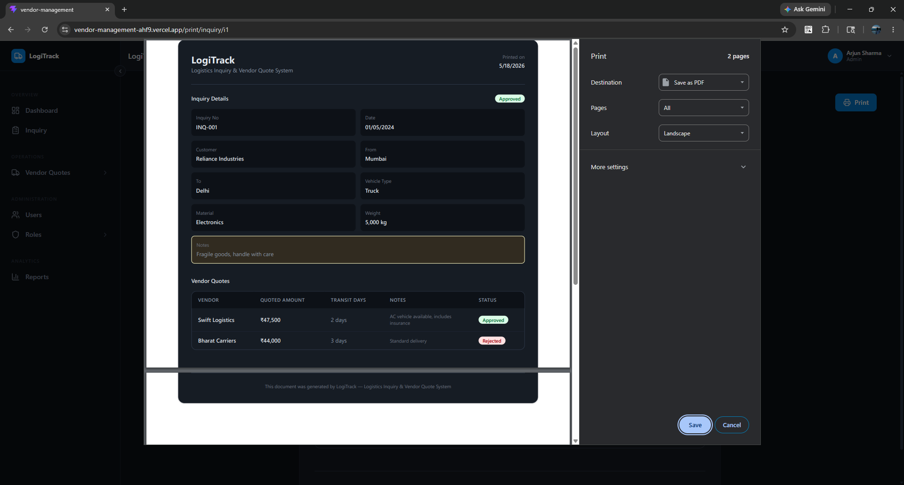

---

## Setup & Run

### Prerequisites

- Node.js ≥ 18
- npm ≥ 9

### Installation

```bash
git clone https://github.com/dhrumil93/vendor-management
cd vendor-management
npm install
npm run dev
```

App runs at **http://localhost:5173**

### Build

```bash
npm run build      # TypeScript check + Vite production build
npm run preview    # Preview the production build
```

### Lint & Format

```bash
npm run lint       # ESLint with zero warnings policy
npm run lint:fix   # Auto-fix lint issues
npm run format     # Prettier format
npm run type-check # TypeScript check only
```

### Tests

```bash
npm run test       # Run Vitest in watch mode
npm run coverage   # Run once with coverage report
```

---

## Demo Credentials

| Role     | Username    | Password      |
| -------- | ----------- | ------------- |
| Admin    | `admin`     | `admin123`    |
| Manager  | `manager1`  | `manager123`  |
| Operator | `operator1` | `operator123` |
| Viewer   | `viewer1`   | `viewer123`   |

---

## Project Structure

```
src/
├── app/                    # Redux store + typed hooks
├── features/               # Redux slices per domain
│   ├── auth/
│   ├── inquiries/
│   ├── vendors/
│   ├── users/
│   └── roles/
├── data/                   # Static mock seed data
├── components/
│   ├── forms/              # Self-contained Yup-validated form components
│   ├── layout/             # Sidebar, Header, MainLayout
│   ├── modals/             # Thin modal wrappers
│   └── ui/                 # Button, Input, Badge, Toggle, Modal, Pagination, ErrorBoundary
├── pages/                  # All screens + NotFound (404)
├── router/                 # AppRouter (lazy routes) + ProtectedRoute
├── hooks/                  # usePermission
├── test/                   # Vitest setup + unit tests
├── utils/                  # helpers.ts + constants.ts
└── types/                  # Shared TypeScript interfaces
```

---

## Code Quality

- **TypeScript strict mode** — full type safety across all files
- **ESLint** — typescript-eslint + react-hooks rules, zero warnings policy
- **Prettier** — consistent formatting
- **Husky pre-commit** — runs lint-staged on staged files
- **commitlint** — enforces Conventional Commits (`feat:`, `fix:`, `chore:`, etc.)

---

## Role-Based Access

| Role     | Dashboard | Inquiries     | Vendor Quotes | Users | Roles | Reports |
| -------- | --------- | ------------- | ------------- | ----- | ----- | ------- |
| Admin    | ✅        | Full CRUD     | Full CRUD     | ✅    | ✅    | ✅      |
| Manager  | ✅        | View/Add/Edit | View/Add/Edit | ❌    | ❌    | ✅      |
| Operator | ✅        | View/Add      | View/Add      | ❌    | ❌    | ❌      |
| Viewer   | ✅        | View only     | View only     | ❌    | ❌    | ❌      |
